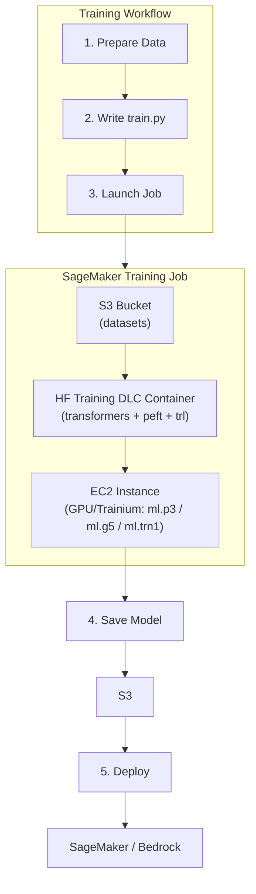

# Train Models on AWS

*A complete guide to all available training paths for fine-tuning Hugging Face models on AWS infrastructure.*

---

## What is Training on AWS?

Training (or fine-tuning) a Hugging Face model on AWS means running a training job on managed or self-managed AWS compute, using Hugging Face's DLCs and libraries, to produce a customized model for your specific task.

---

## Training Paths at a Glance

| Method | Managed? | Best For | Complexity |
|--------|----------|----------|------------|
| [SageMaker SDK](./08-train-sagemaker-sdk.md) | ✅ Fully managed | Fine-tuning, distributed training, cost-efficient spot | Medium |
| [ECS / EKS / EC2](./09-train-ecs-eks-ec2.md) | ❌ Self-managed | Full control, existing Kubernetes/container pipelines | High |

---

## Key Concepts

### Hugging Face Training DLCs
Hugging Face provides pre-built Docker images optimized for training:
- Includes `transformers`, `datasets`, `tokenizers`, `accelerate`, `peft`, `trl`
- Integrated with SageMaker distributed training libraries
- Available for PyTorch and TensorFlow
- Supported on GPU (P3, P4, G5) and AWS Trainium (`trn1`)

### Fine-Tuning Techniques
| Technique | Library | Use Case |
|-----------|---------|----------|
| Full Fine-Tuning | `transformers` + `Trainer` | Small models, unlimited GPU |
| LoRA / QLoRA | `peft` | Parameter-efficient, large models |
| RLHF / SFT | `trl` | Instruction tuning, chat alignment |
| Prompt Tuning | `peft` | Very few trainable params |

### AWS Cost Optimization
- **EC2 Spot Instances** via SageMaker — up to **90% cost reduction**
- **AWS Trainium** — up to **50% lower training cost** vs comparable GPU instances
- **SageMaker Checkpointing** — resume interrupted spot jobs automatically

---

## Architecture Overview

---

## Recommended Instance Types for Training

| Instance | GPU | Memory | Best For |
|----------|-----|--------|----------|
| `ml.p3.2xlarge` | 1x V100 | 16 GB | Small model fine-tuning |
| `ml.p3.16xlarge` | 8x V100 | 128 GB | Distributed training |
| `ml.g5.2xlarge` | 1x A10G | 24 GB | Mid-size LLM fine-tuning |
| `ml.g5.48xlarge` | 8x A10G | 192 GB | Large model QLoRA |
| `ml.p4d.24xlarge` | 8x A100 | 320 GB | Large-scale pretraining |
| `ml.trn1.32xlarge` | 16x Trainium | 512 GB | Cost-efficient training |

---

## Training vs Fine-Tuning

| | Pre-Training | Fine-Tuning |
|--|-------------|-------------|
| Starting point | Random weights | Pre-trained model |
| Data needed | Billions of tokens | Thousands–millions of examples |
| Compute needed | Very high (trn1, p4) | Medium (g5, p3) |
| Time | Weeks–months | Hours–days |
| Common on AWS | Rarely | Very common |

---

## Next Steps

- 👉 [Train with SageMaker SDK](./08-train-sagemaker-sdk.md)
- 👉 [Train with ECS, EKS, EC2](./09-train-ecs-eks-ec2.md)