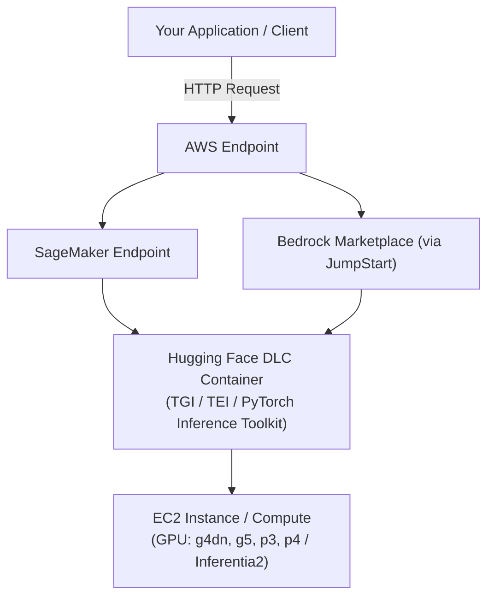

# Deploy Models on AWS 

*A complete guide to all available deployment paths for Hugging Face models on AWS infrastructure.*

---

## What is Deployment?

Deploying a Hugging Face model on AWS means hosting it as a live, scalable API endpoint that can accept inference requests from your applications. AWS offers multiple services for this depending on your requirements for control, scalability, speed-to-deploy, and cost.

---

## Deployment Paths at a Glance

| Method | Managed? | Best For | Complexity |
|--------|----------|----------|------------|
| [SageMaker SDK](./02-deploy-sagemaker-sdk.md) | ✅ Fully managed | Post-training deployment, custom models from S3 | Medium |
| [SageMaker JumpStart](./03-deploy-sagemaker-jumpstart.md) | ✅ Fully managed | One-click deployment of popular open models | Low |
| [AWS Bedrock](./04-deploy-bedrock.md) | ✅ Fully managed | Generative AI apps needing Agents, Guardrails, Knowledge Bases | Low–Medium |
| [HF Inference Endpoints](./05-deploy-inference-endpoints.md) | ✅ Fully managed (by HF) | Fast, managed, HF-native deployment on AWS hardware | Low |
| [ECS / EKS / EC2](./06-deploy-ecs-eks-ec2.md) | ❌ Self-managed | Full control, custom stacks, production microservices | High |

---

## Key Concepts

### Deep Learning Containers (DLCs)
Hugging Face provides pre-built, optimized Docker images (DLCs) for inference and training. They come pre-installed with:
- `transformers`, `tokenizers`, `datasets`
- `text-generation-inference` (TGI) for LLM serving
- `text-embeddings-inference` (TEI) for embedding models
- Full AWS support (S3, ECR, SageMaker)

DLCs power ALL deployment methods under the hood — from SageMaker to ECS/EKS/EC2.

### Inference Toolkit
The `sagemaker-huggingface-inference-toolkit` is a first-class library bundled with Hugging Face PyTorch DLCs for inference. It lets you serve any PyTorch model on AWS with no custom serving code required.

### Endpoint Types (SageMaker)
- **Real-time endpoints** — Low latency, synchronous, always-on
- **Asynchronous endpoints** — Long-running requests, queued
- **Serverless endpoints** — Pay-per-use, scales to zero
- **Batch transform jobs** — Offline inference on large datasets
- **Multi-model endpoints** — Host multiple models on one endpoint

---

## Architecture Overview

---

## Supported Instance Types

| Family | Use Case | Example |
|--------|----------|---------|
| `ml.m5` / `ml.c5` | CPU inference, small models | `ml.m5.xlarge` |
| `ml.g4dn` | GPU inference, mid-size LLMs | `ml.g4dn.2xlarge` |
| `ml.g5` | GPU inference, large LLMs | `ml.g5.12xlarge` |
| `ml.p3` | GPU training & inference | `ml.p3.2xlarge` |
| `ml.p4` | Large-scale GPU training | `ml.p4d.24xlarge` |
| `ml.inf2` | Inferentia2, cost-efficient LLM inference | `ml.inf2.xlarge` |
| `ml.trn1` | Trainium, cost-efficient training | `ml.trn1.32xlarge` |

---

## Security Considerations

- All SageMaker endpoints support **VPC isolation** (network isolation mode)
- Data is **encrypted at rest and in transit**
- IAM roles control all resource access
- CloudWatch provides monitoring and logging
- Supports HIPAA, SOC 2, GDPR, and FedRAMP compliance

---

## Next Steps

Pick your deployment path:

- 👉 [Deploy with SageMaker SDK](./02-deploy-sagemaker-sdk.md)
- 👉 [Deploy with SageMaker JumpStart](./03-deploy-sagemaker-jumpstart.md)
- 👉 [Deploy with AWS Bedrock](./04-deploy-bedrock.md)
- 👉 [Deploy with HF Inference Endpoints](./05-deploy-inference-endpoints.md)
- 👉 [Deploy with ECS, EKS, EC2](./06-deploy-ecs-eks-ec2.md)